# Flight Price Prediction

A machine learning system for predicting flight ticket prices using Python, scikit-learn, XGBoost, CatBoost, and FastAPI.

## Problem Description

Airlines dynamically price tickets based on multiple factors including:
- **Route**: Source and destination cities affect base pricing
- **Timing**: Departure time, day of week, and season impact prices
- **Airline carrier**: Different airlines have different pricing strategies
- **Number of stops**: Direct flights typically cost more than connecting flights
- **Booking class**: Business vs economy affects pricing significantly

This system predicts flight prices to help:
- **Travelers**: Find optimal booking times and routes
- **Airlines**: Optimize pricing strategies
- **Travel agencies**: Provide better price estimates

The model is trained on the [Kaggle Flight Price Prediction Dataset](https://www.kaggle.com/datasets/shubhambathwal/flight-price-prediction/data) and achieves **R² > 0.85** using random forest algorithm.

## Features

- Comprehensive EDA with visualizations
- 6 ML models trained and compared
- Hyperparameter tuning with RandomizedSearchCV
- FastAPI REST API for predictions
- Docker containerization for deployment
- Full reproducibility with random_state=42

## Screenshots

### Exploratory Data Analysis

|                   Dataset Overview                    |                  Missing Values                   |
|:-----------------------------------------------------:|:-------------------------------------------------:|
| 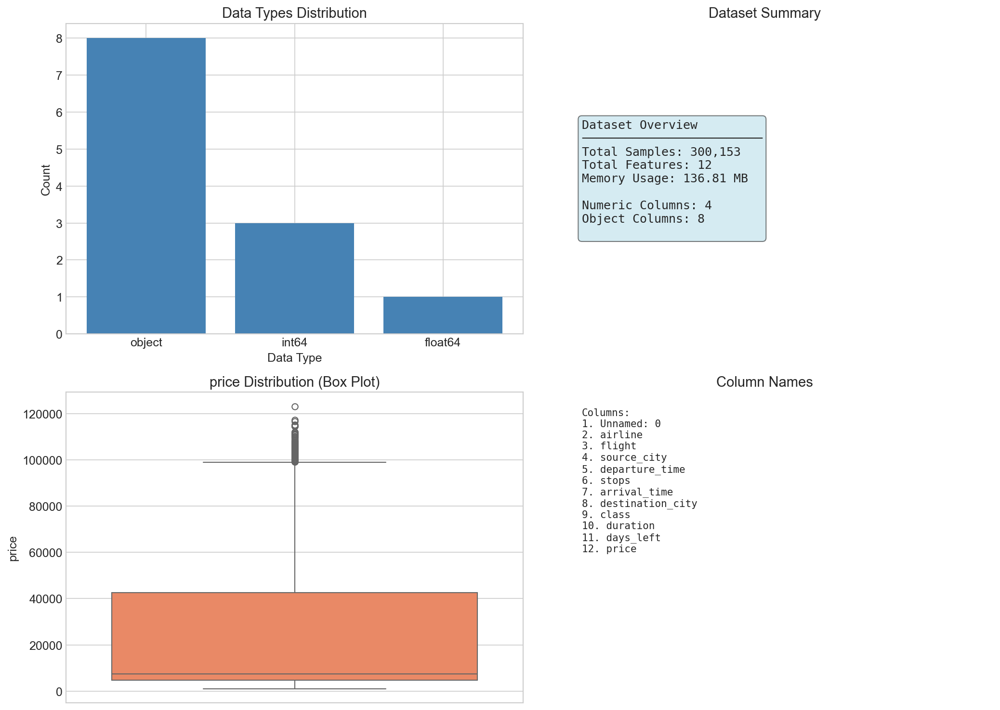 | 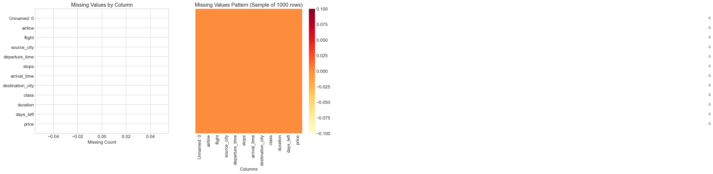 |

| Price Distribution | Feature Distributions |
|:---:|:---:|
| 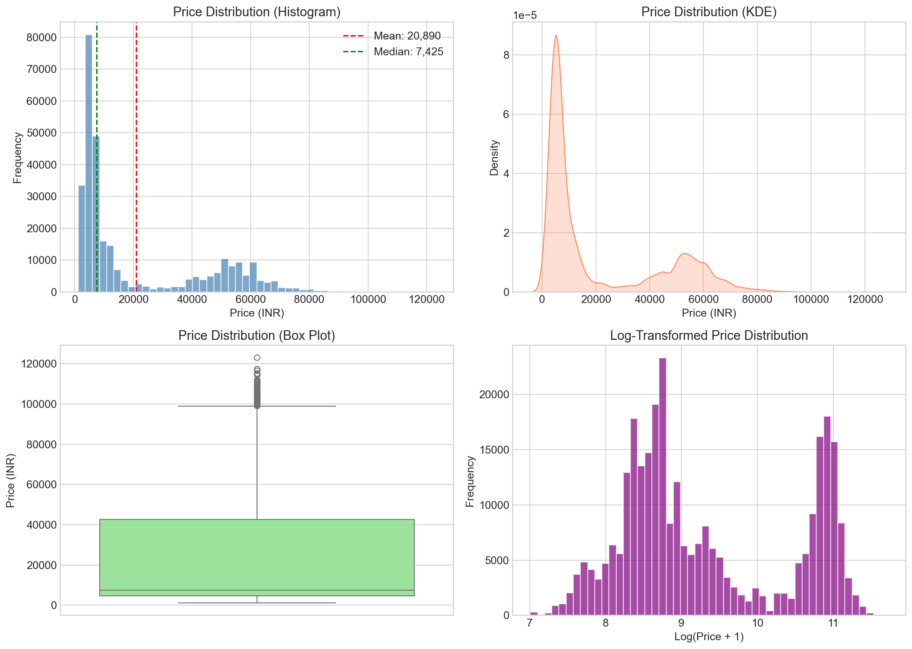 | 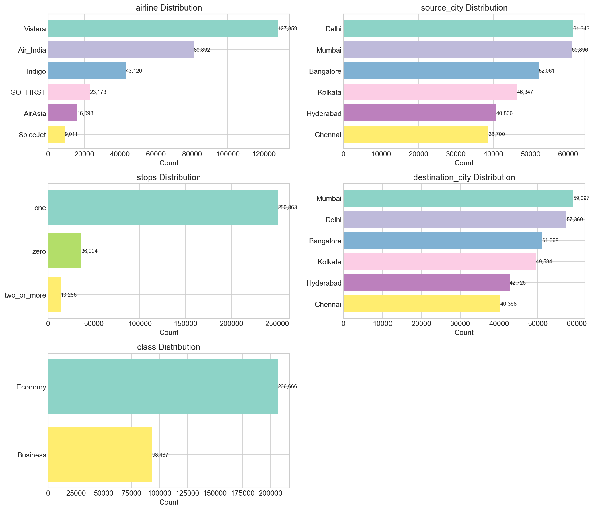 |

| Correlation Heatmap | Datetime Features |
|:---:|:---:|
| 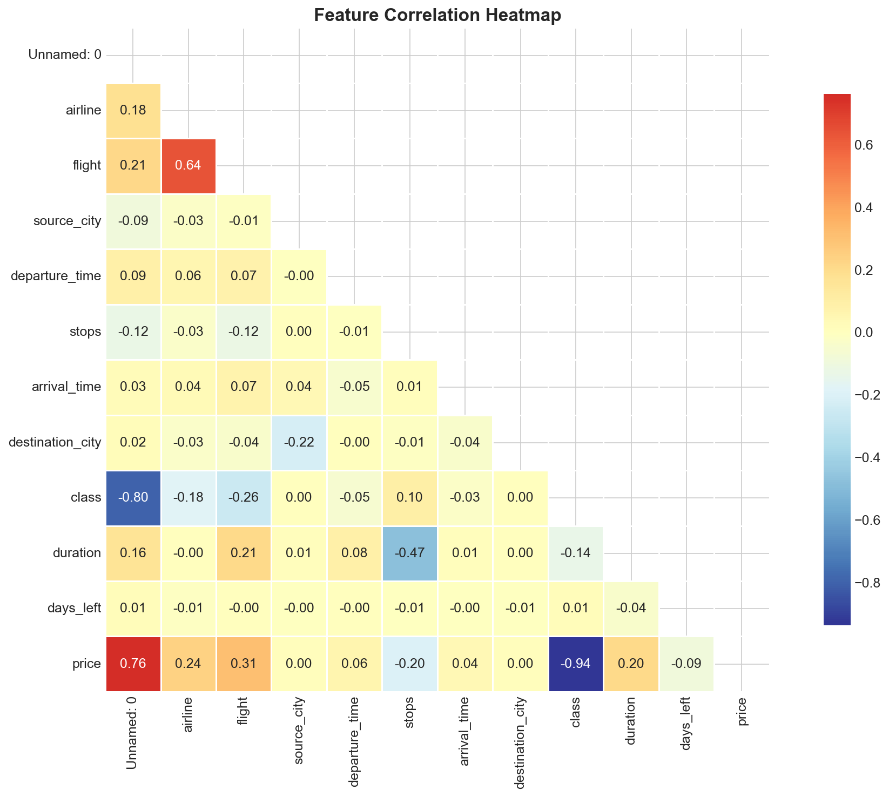 | 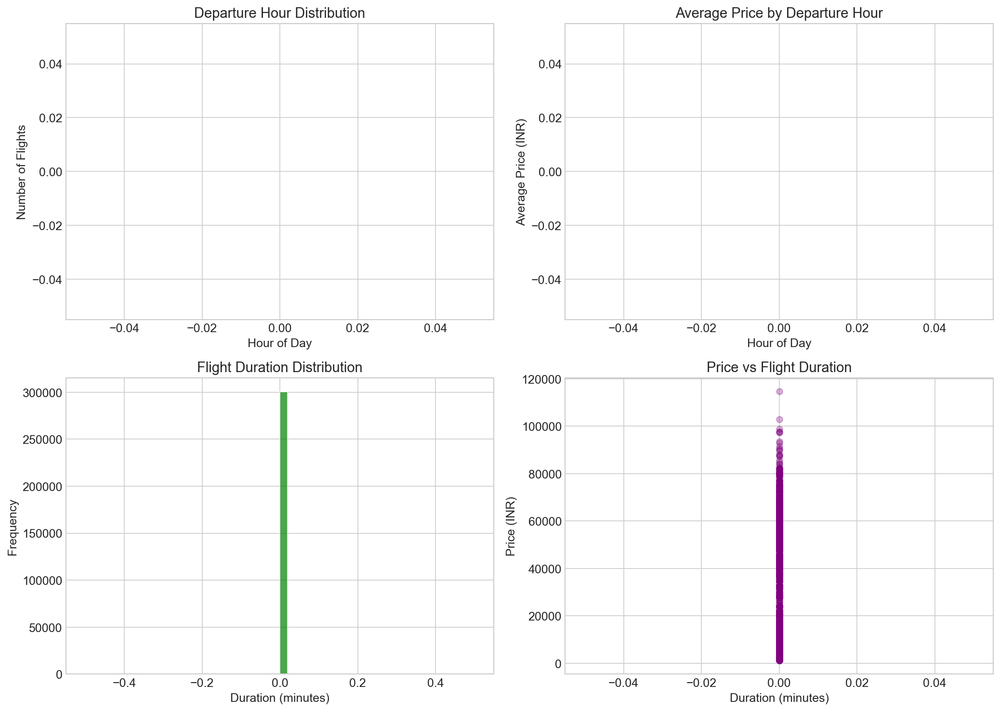 |

### Feature Importance

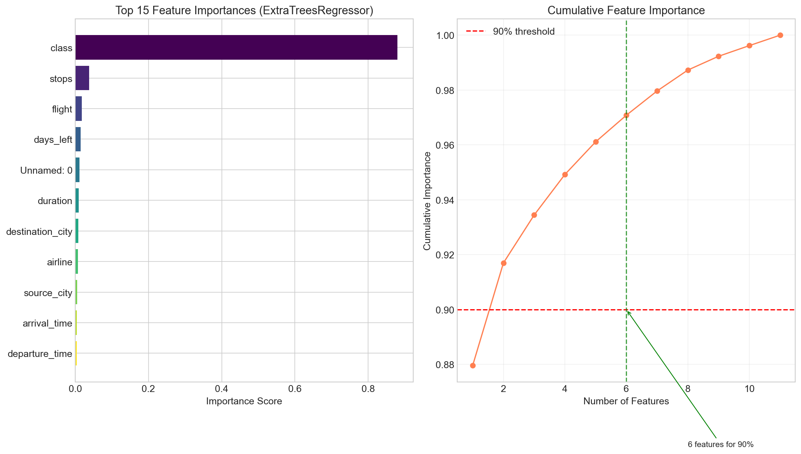

### Model Training

|                   Model Comparison                    |                Best Model Performance                 |
|:-----------------------------------------------------:|:-----------------------------------------------------:|
| 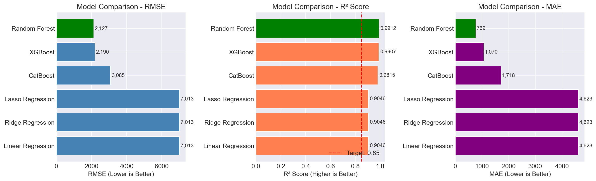 | 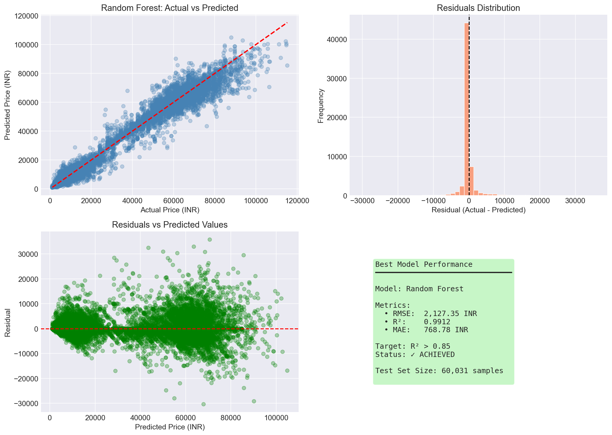 |

### Hyperparameter Tuning

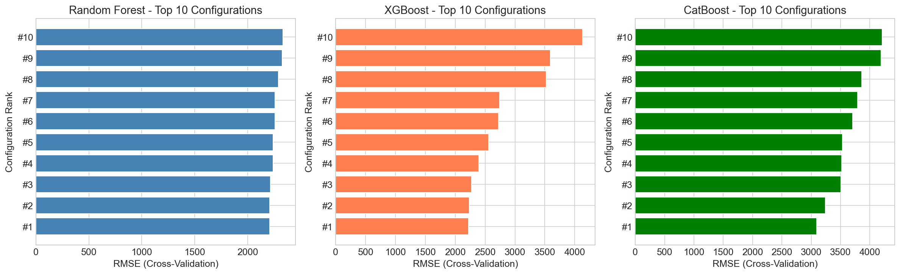

### API Documentation

| Swagger UI | ReDoc |
|:---:|:---:|
| 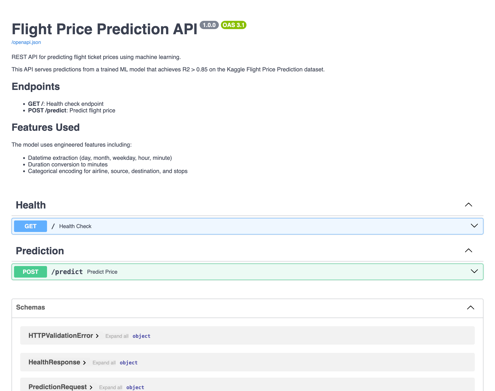 | 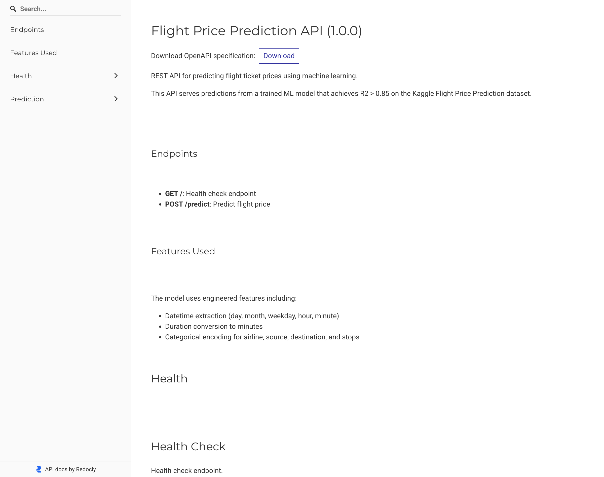 |

### API Testing

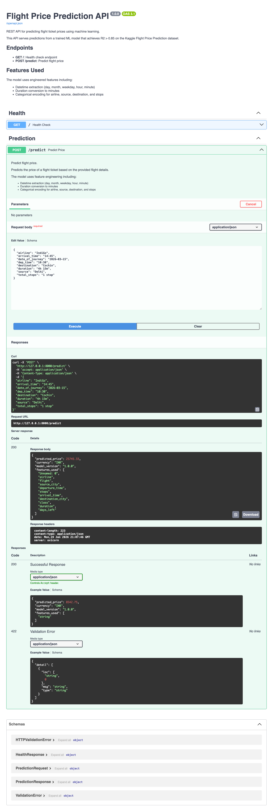

## Dataset

Download the dataset from Kaggle and place it in the `dataset/` folder:

1. Go to [Kaggle Flight Price Prediction Dataset](https://www.kaggle.com/datasets/shubhambathwal/flight-price-prediction/data)
2. Download the dataset (requires Kaggle account)
3. Extract and place the CSV file:

```bash
mkdir -p dataset
mv ~/Downloads/Clean_Dataset.csv dataset/
```

The dataset directory is gitignored due to file size.

## Environment Setup

### Prerequisites

- Python 3.13+
- [uv](https://docs.astral.sh/uv/) package manager

### Installation

```bash
# Install uv (if not already installed)
curl -LsSf https://astral.sh/uv/install.sh | sh

# Clone repository
git clone https://github.com/devnovikov/flight-price-prediciton.git
cd flight-price-prediciton

# Create virtual environment and install dependencies
uv sync

# Activate virtual environment
source .venv/bin/activate  # On Windows: .venv\Scripts\activate
```

## Training

### Option 1: Jupyter Notebook (Recommended for EDA)

```bash
# Start Jupyter
uv run jupyter notebook notebooks/notebook.ipynb
```

The notebook includes:
- Complete exploratory data analysis
- Feature engineering
- Model training and comparison
- Hyperparameter tuning
- All visualizations saved to `screenshots/`

### Option 2: Production Training Script

```bash
# Train model using production script
uv run python src/train/train.py
```

Expected output:
```
============================================================
FLIGHT PRICE PREDICTION - MODEL TRAINING
============================================================

Random State: 42
Loading data from dataset/Clean_Dataset.csv...
  Loaded 300,153 rows, 12 columns
Preprocessing data...
  Features shape: (300153, 11)

============================================================
TRAINING MODELS
============================================================

Baseline models:
  Training Linear Regression...
  Training Ridge Regression...
  Training Lasso Regression...

Models with hyperparameter tuning:
  Tuning Random Forest...
  Tuning XGBoost...
  Tuning CatBoost...

============================================================
MODEL COMPARISON (sorted by RMSE)
============================================================
            Model        RMSE       R2         MAE
    Random Forest 2127.354825 0.991221  768.780202
          XGBoost 2189.536252 0.990700 1069.969849
         CatBoost 3084.850592 0.981539 1718.064701
 Lasso Regression 7012.694003 0.904598 4622.719640
 Ridge Regression 7012.704891 0.904598 4623.039426
Linear Regression 7012.705115 0.904598 4622.989854

============================================================
BEST MODEL
============================================================

Best Model: Random Forest
  RMSE: 2,127.35
  R2: 0.9912

Best Hyperparameters: {'n_estimators': 300, 'min_samples_split': 2, 'min_samples_leaf': 1, 'max_depth': None}
```

## API Usage

### Start the Server

```bash
# Start FastAPI server
uv run uvicorn src.predict.predict:app --reload
```

Server will start at http://localhost:8000

### Interactive Documentation

- **Swagger UI**: http://localhost:8000/docs
- **ReDoc**: http://localhost:8000/redoc

### API Endpoints

#### Health Check

```bash
curl http://localhost:8000/
```

Response:
```json
{
  "status": "healthy",
  "model_loaded": true,
  "version": "1.0.0"
}
```

#### Predict Price

```bash
curl -X POST http://localhost:8000/predict \
  -H "Content-Type: application/json" \
  -d '{
    "airline": "IndiGo",
    "source": "Delhi",
    "destination": "Cochin",
    "date_of_journey": "2026-03-15",
    "dep_time": "10:30",
    "arrival_time": "14:45",
    "duration": "4h 15m",
    "total_stops": "1 stop"
  }'
```

Response:
```json
{
  "predicted_price": 8542.75,
  "currency": "INR",
  "model_version": "1.0.0",
  "features_used": ["Journey_day", "Journey_month", "..."]
}
```

## Docker

### Build Image

```bash
# Ensure model is trained first
uv run python src/train/train.py

# Build Docker image
docker build -t flight-price-api .
```

### Run Container

```bash
# Run container
docker run -p 8000:8000 flight-price-api
```

### Test Container

```bash
# Health check
curl http://localhost:8000/

# Make prediction
curl -X POST http://localhost:8000/predict \
  -H "Content-Type: application/json" \
  -d '{
    "airline": "IndiGo",
    "source": "Delhi",
    "destination": "Cochin",
    "date_of_journey": "2026-03-15",
    "dep_time": "10:30",
    "arrival_time": "14:45",
    "duration": "4h 15m",
    "total_stops": "1 stop"
  }'
```

## Project Structure

```
flight-price-prediciton/
├── dataset/                    # Kaggle dataset (gitignored)
│   └── Clean_Dataset.csv
├── models/                     # Trained model artifacts
│   └── best_model.joblib
├── notebooks/
│   └── notebook.ipynb          # EDA and model training
├── screenshots/                # Visualizations (13 images)
├── src/
│   ├── __init__.py
│   ├── train/
│   │   ├── __init__.py
│   │   ├── constants.py        # Configuration constants
│   │   ├── preprocessing.py    # Data preprocessing
│   │   └── train.py            # Production training script
│   └── predict/
│       ├── __init__.py
│       ├── schemas.py          # Pydantic models
│       ├── model_loader.py     # Model loading utility
│       ├── preprocessing.py    # Inference preprocessing
│       └── predict.py          # FastAPI application
├── tests/
│   └── __init__.py
├── specs/                      # Feature specifications
├── .gitignore
├── .dockerignore
├── pyproject.toml              # Dependencies (uv)
├── uv.lock                     # Locked versions
├── Dockerfile
└── README.md
```

## Models Trained

| Model | RMSE | R² Score | MAE |
|---|---:|---:|---:|
| **Random Forest** | **2127.354825** | **0.991221** | **768.780202** |
| XGBoost | 2189.536252 | 0.990700 | 1069.969849 |
| CatBoost | 3084.850592 | 0.981539 | 1718.064701 |
| Lasso Regression | 7012.694003 | 0.904598 | 4622.719640 |
| Ridge Regression | 7012.704891 | 0.904598 | 4623.039426 |
| Linear Regression | 7012.705115 | 0.904598 | 4622.989854 |

*Best model (**Random Forest**) achieves R² > 0.85 target.*


## Reproducibility

- **Random State**: All random operations use `random_state=42`
- **Dependencies**: Locked with `uv.lock` for exact versions
- **Dataset**: Download instructions provided above

### Cloud deployment

#### Deploy Docker with CLI on Google Cloud
The current model can be deployed to Google Cloud for prediction. Follow the steps.
1. Install prerequisites
```bash
# Install Google Cloud SDK
curl https://sdk.cloud.google.com | bash
exec -l $SHELL

# Login and set project
gcloud auth login
gcloud config set project YOUR_PROJECT_ID
```
2. Enable required APIs
```bash
gcloud services enable run.googleapis.com cloudbuild.googleapis.com
```
3. Build and push to Google Container Registry
```bash
gcloud builds submit --tag gcr.io/YOUR_PROJECT_ID/flight-price-api
```
4. Deploy to Cloud Run
```bash
gcloud run deploy traffic-sign-api \
  --image gcr.io/YOUR_PROJECT_ID/flight-price-api \
  --platform managed \
  --region us-central1 \
  --memory 4Gi \
  --cpu 2 \
  --timeout 600 \
  --allow-unauthenticated
```

## Tech Stack

- **Language**: Python 3.13
- **Package Manager**: uv
- **ML Frameworks**: scikit-learn, XGBoost, CatBoost
- **API**: FastAPI, uvicorn, Pydantic
- **Visualization**: matplotlib, seaborn
- **Containerization**: Docker


## License

This project is for educational purposes. The dataset is from Kaggle and subject to its license terms.
